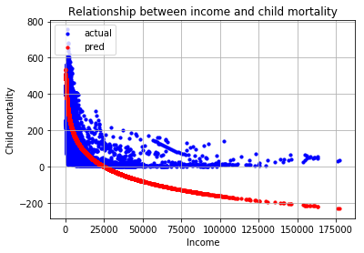

# Gapminder_Visualization_2

# HW 2

## Problem 1
Link to the piazza post: https://piazza.com/class/k05u5i0wc3w540?cid=235

## Problem 2
I choose to critique the visualization of Parth Tandel. Link to the original: 
https://nbviewer.jupyter.org/github/ParthTandel/DS5500-Assignment-1/blob/master/Combined_Questions.ipynb.

To plot the distribution of income across countries and 
continents over time, he has visualized 6 plots. The first
plot is to see the relationship between the income across 
countries over time using a line plot for each country. 
Then he has used 4 plots (one for each continent) get the relationship between
the income across countries over time in a particular 
continent using a line plot for each country. Then he has used
one plot to visualized the aggregated income for each
continent over time.

The plot that we have created are similar as I have created 
all the plot created by him but apart from that have visualized
income across all the countries individually in separate plot
and using color to group countries by continents. Also, I have 
visualized each continent separately too.

His plot is easy to interpret when you want to see the how the
income is changing over time across continents. But it gets 
difficult to interpret how the income is changing across 
countries as it is difficult to distinguish among so many colors. It gets better when the countries are divided by
continents but is still difficult as there are many countries.

It does effectively visualized what is asked but can be a bit
hard to read as it has a lot of information in a static plot.
It would have been better if an interactive plot would have 
been used by both of us.

## Problem 3
 I choose to critique the visualization of Monica Mishra. Link to
 the original visualization is  https://colab.research.google.com/drive/1v8EY74vQxPubjXHywpDUYo7a3FMj-GuB
 
To plot the the relationship between income (GDP / capita), life expectancy, and child
mortality over time within each continent, she has used 3 plots. One plot to visualize the
relationship between income over time for each continent, one to visualize the
relationship between life expectancy over time for each continent and one plot to 
visualize the relationship between income over time for each continent

The major difference between our plot is that I have plotted 4 plots, one for
each continent and visualized the relationship between income (GDP / capita), life expectancy, and child
mortality over time for that continent. Another different is that she has used interactive
plot and I have used a static plot. I feel that here interactive plot is not helping 
much in the visualization and a static plot should suffice as there is not a lot of 
information in the plot. Also interactivity adds computational overhead. 

It is easy to interpret as the plot is well labelled and doesn't have too much 
information in a single plot. 

It effectively visualizes what is being asked, as 
it does show the relationship of income over time across continents, relationship of life expectancy over time across 
continents and relationship of child mortality over time across continents.
But it is fails to capture the relationship between income, life expectancy and 
child mortality over time which each other as they are not in the same plot.  

## Problem 4
I choose linear regression model with different transformations to quantify the 
relationship between income (GDP per capita) and life expectancy over time.

To get the data, I merged the data frame for gdp per capita, life expectancy and child mortality
on year and geo. 

life_expectancy ~ income

First to model the relationship, I choose a linear regression model with no transformation.
On evaluating the model, Mean squared error was 178.85 and Variance score was 0.32.
On visualizing the model we can see that it is not a good fit for the data.

Plotting the residual plot for the model

Here we can clearly see that the residuals are not randomly distributed and the linear 
model with no transformation on the variables is not a good fit for the data.

On looking at a plot I feel that applying log transformation on income might 
result in a good fit.

life_expectancy ~ log(income)

On trying that, the Mean squared error is 87.64 and Variance score is 0.67.
On visualizing the model we can see that it is a better fit than the previous model
for the data.

Plotting the residual plot for the model

On taking year into account and modeling a multivariate linear regression model.
Here I am taking log transform of income and year with no transformation.

life_expectancy ~ log(income) + year

On trying that, the Mean squared error is 54.50 and Variance score is 0.79.
On visualizing the model we can see that it is a better fit than the previous model
for the data.

Plotting the residual plot for the model

Here we can clearly see that this model is better than all the previously tried models.
This model uses time, and it is evident from the plot that as year increases life expectancy and income increases.
So incorporating year into the model improves its performance.

From the plot we can see that life expectancy increases as income increases and becomes steady after 
sometime around when income is greater than 50K. Still the life expectancy is around 80 and 
doesn't increase much as income increases further.  

The relevant code for this can be found at Gapminder_2.ipynb under Problem 4 headline.

## Problem 5

<b> child_mortality ~ income </b>

I choose linear regression model with different transformations to quantify the 
relationship between income (GDP per capita) and child mortality over time.

First to model the relationship, I choose a linear regression model with no transformation.
On evaluating the model, Mean squared error was 19971.17 and Variance score was 0.27.
On visualizing the model we can see that it is not a good fit for the data.

Plotting the residual plot for the model

Here we can clearly see that the residuals are not randomly distributed and the linear 
model with no transformation on the variables is not a good fit for the data as the distribution is 
not linear.

<b>child_mortality ~ log(income)</b>

Trying linear model with log transformation on income. On evaluating the model, Mean squared error 
was 9916.22 and Variance score was 0.64.
Visualizing the fit and the residuals.

Plotting the residual plot for the model

On visualizing the model we can see that it is a better fit than the previous model for the data.

On taking year into account and modeling a multivariate linear regression model.
Here I am taking log transform of income and year with no transformation.

<b>child_mortality ~ log(income) + year </b>

On trying that, the Mean squared error is 5956.31 and Variance score is 0.78.
On visualizing the model we can see that it is a better fit than the previous model
for the data.

Plotting the residual plot for the model

Here we can clearly see that this model is better than all the previously tried models.
This model uses time, and it is evident from the plot that as year increases child mortality decreases
and income increases.
So incorporating year into the model improves its performance.

From the plot we can see that life expectancy increases as income increases and becomes steady after 
sometime around when income is greater than 50K. Still the child mortality is around 50 and 
doesn't decrease much as income increases further.  

The relevant code for this can be found at Gapminder_2.ipynb under Problem 5 headline.

